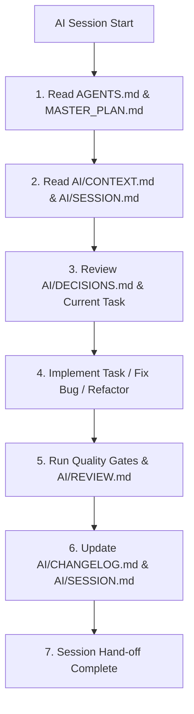

# AI Collaboration System & Workflow Architecture

Version: 1.0  
Project: Pritish Kumar Panda Portfolio  
Directory: `/AI`  

---

# 1. System Overview

The `/AI` directory serves as the **persistent multi-agent knowledge system** for this repository. It enables multiple AI agents (and human engineers across different sessions) to collaborate seamlessly as a disciplined software engineering team without losing context, regressing decisions, or violating repository contracts.

---

# 2. Operating Rules

## Session Initialization Rules
1. **Mandatory First Action**: Read `AGENTS.md`, `MASTER_PLAN.md`, `AI/CONTEXT.md`, and `AI/SESSION.md` before taking any action.
2. **Context Synchronization**: Check `AI/BUGS.md` for active blockers and `AI/DECISIONS.md` to avoid re-proposing previously rejected architectural patterns.
3. **No Blind Execution**: Never begin coding without verifying current sprint status in `MASTER_PLAN.md`.

## Session Termination Rules
1. **Update Session Memory**: Record completed tasks, active state, and next steps in `AI/SESSION.md`.
2. **Log All Code Changes**: Append entries to `AI/CHANGELOG.md` detailing modified files, rationale, and verification results.
3. **Record Decisions & Questions**: Log architectural trade-offs in `AI/DECISIONS.md` and unanswered user queries in `AI/QUESTIONS.md`.

## Workflow Rules by Activity
- **Feature Implementation**: Read `COMPONENTS.md` & `DESIGN_SYSTEM.md` → Implement incrementally → Execute `npm run typecheck` & `npm run lint` → Record in `AI/CHANGELOG.md`.
- **Bug Fixing**: Read `AI/BUGS.md` → Trace log/stack trace first (no blind fixes) → Verify underlying root cause → Fix root cause → Update `AI/BUGS.md`.
- **Refactoring**: Verify component usages in `COMPONENTS.md` → Ensure zero breaking changes to prop interfaces → Verify performance budget in `PERFORMANCE.md`.
- **Performance Optimization**: Check budget in `PERFORMANCE.md` → Target GPU properties (`transform`, `opacity`) → Verify Lighthouse ≥95 score.
- **Accessibility Improvements**: Follow `ACCESSIBILITY.md` → Verify focus rings, WCAG 2.1 AA contrast, screen reader labels, and keyboard tab order.
- **Code Review**: Audit against `AI/REVIEW.md` and `AI/CHECKLISTS/code_review_checklist.md`.

---

# 3. File Index & Relationships

| File | Primary Role | Relationship to `AGENTS.md` & `MASTER_PLAN.md` |
|---|---|---|
| `AI/AI_OS.md` | AI Operating System specification & agent roster | Defines multi-agent roles, governance & slash commands |
| `AI/CONTEXT.md` | Core architecture & stack state | Operational context for `MASTER_PLAN.md` |
| `AI/SESSION.md` | Multi-agent hand-off & current state | Tactical tracker enforcing `AGENTS.md` workflow |
| `AI/DECISIONS.md` | Architecture Decision Records (ADRs) | Enforces technical standards from `MASTER_PLAN.md` |
| `AI/CHANGELOG.md` | Chronological git-level change log | Audit trail verifying `MASTER_PLAN.md` milestones |
| `AI/BUGS.md` | Active bug tracker & root cause logs | Prevents regressions outlined in `AGENTS.md` |
| `AI/QUESTIONS.md` | Open user & design clarifying queries | Escalation queue per `AGENTS.md § When Unsure` |
| `AI/IDEAS.md` | Backlog of future feature concepts | Feeds into `MASTER_PLAN.md § Continuous Improvement` |
| `AI/REVIEW.md` | Self-review & quality gate checklist | Enforces `MASTER_PLAN.md § Quality Gates` |
| `AI/PROMPT_GUIDE.md` | Guidelines for prompt engineering | Instructs AI agents on executing repository tasks |
| `AI/CHECKLISTS/` | Task-specific quality checklists | Operational gates for code review & release |
