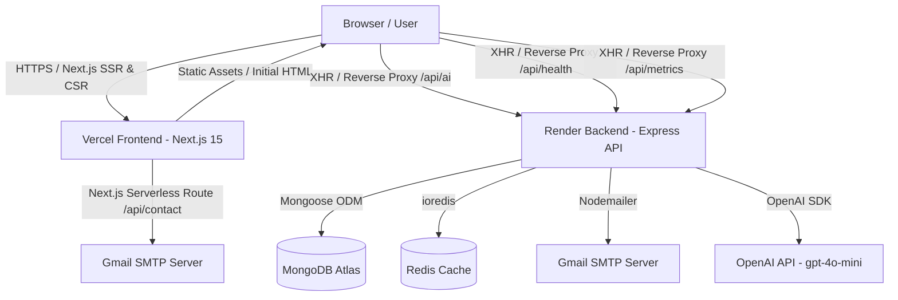

# ARCHITECTURE.md
Version: 1.0
Project: Pritish Kumar Panda Portfolio

---

# System Overview

The **Pritish Kumar Panda Portfolio** is architected as a production-grade MERN/Next.js monorepo. It features a decoupled, performance-optimized frontend deployed on **Vercel** and a resilient, secured backend API deployed on **Render** (with support for Docker and PM2 orchestration).

The architecture separates static content delivery and cinematic UI rendering from backend business logic, AI assistant integrations, transactional email workflows, and state persistence.



---

# Tech Stack

## Frontend

| Technology | Version | Purpose |
|---|---|---|
| Next.js | `^15.0.0` | React Framework (App Router, Server Components, Route Handlers, Image Optimization) |
| React | `^19.0.0` | Core UI Component Library |
| React DOM | `^19.0.0` | DOM Rendering Engine |
| TypeScript | `^5.0.0` | Type safety, Interfaces, and Developer Ergonomics |
| Tailwind CSS | `^3.4.17` | Utility-first CSS Framework with custom design tokens |
| Framer Motion | `^12.0.0` | Declarative animations, layout transitions, and gesture handling |
| GSAP | `^3.13.0` | High-performance scroll-driven and timeline visual sequences |
| Lenis | `^1.3.4` | Smooth scroll physics normalization |
| Radix UI Dialog | `^1.1.0` | Accessible, unstyled modal dialog primitive (`@radix-ui/react-dialog`) |
| Radix UI Slot | `^1.1.0` | Flexible component composition primitive (`@radix-ui/react-slot`) |
| React Icons | `^5.5.0` | Iconography suite |
| Class Variance Authority | `^0.7.1` | Type-safe variant creation for UI components |
| clsx | `^2.1.1` | Conditional classname utility |
| tailwind-merge | `^3.3.1` | Utility class merging without conflicts |
| Nodemailer | `^9.0.1` | Direct serverless contact email delivery |

## Backend

| Technology | Version | Purpose |
|---|---|---|
| Node.js | `>=18.0.0` | Backend JavaScript Runtime Environment |
| Express | `^5.2.1` | Web framework for API endpoints, routing, and middleware |
| Mongoose | `^9.5.0` | MongoDB Object Data Modeling (ODM) with connection pooling |
| ioredis | `^5.6.1` | Redis client with graceful fallback for response & metadata caching |
| Pino | `^9.6.0` | Low-overhead structured JSON logger |
| Pino Pretty | `^13.0.0` | Formatted log viewer for local development |
| Nodemailer | `^8.0.6` | Transactional email transmission for backend API |
| Helmet | `^8.1.0` | Security headers enforcement (CSP, HSTS, X-Frame-Options) |
| CORS | `^2.8.6` | Cross-Origin Resource Sharing strict whitelist policy |
| express-rate-limit | `^8.4.1` | Tiered IP-based rate limiting middleware |
| express-validator | `^7.3.2` | Request body validation and sanitization middleware |
| express-mongo-sanitize | `^2.2.0` | NoSQL query injection prevention |
| compression | `^1.8.0` | Gzip response compression middleware |
| uuid | `^11.1.0` | Unique Request ID generation (`X-Request-ID`) |
| dotenv | `^17.4.2` | Environment variable management |
| OpenAI API | Model: `gpt-4o-mini` | AI RAG chatbot assistant execution |

## Dependency Policy

Dependencies are evaluated strictly before addition to keep bundle sizes lean and prevent supply-chain vulnerabilities.

### Evaluation Criteria
1. **Built-in Alternative**: Can this feature be built natively with modern Web APIs or Node.js built-ins in under 50 lines?
2. **Bundle Cost**: What is the uncompressed and gzipped impact on the client bundle?
3. **Tree-shakeability**: Does the package support ES module imports and subpath exports?
4. **Maintenance Health**: Is the repository actively maintained with zero unpatched vulnerabilities?

For performance constraints and client bundle budgeting guidelines, see PERFORMANCE.md § Third-Party Dependencies.

---

# Directory Structure

## Repository Root

```
portfolio/
├── frontend/             # Next.js 15 client application
├── backend/              # Node.js / Express API service
├── AGENTS.md             # Subagent behaviors, workflow rules, and decision hierarchy
├── PORTFOLIO.md          # Product vision, target recruiter personas, and messaging
├── PERFORMANCE.md        # Core Web Vitals, JS bundle budgets, and optimization targets
├── SEO.md                # Search engine optimization, structured data, and meta strategies
├── ARCHITECTURE.md       # Technical blueprint and system architecture document
├── COMPONENTS.md         # Component design system registry and prop specifications
├── DESIGN_SYSTEM.md      # Visual identity, typography, and design token definitions
└── package.json          # Root workspace scripts ("dev", "install-all")
```

## Frontend Directory (`frontend/`)

```
frontend/
├── app/                  # Next.js 15 App Router directory
│   ├── api/
│   │   └── contact/
│   │       └── route.ts  # POST serverless contact email handler
│   ├── globals.css       # Global styles, Tailwind directives, and CSS variables
│   ├── layout.tsx        # Root layout, metadata, font loading (Space Grotesk), SiteProviders
│   ├── page.tsx          # Single-page entry point, JSON-LD schema, dynamic imports
│   ├── robots.txt        # Crawler indexing directives
│   ├── sitemap.xml       # XML sitemap definition
│   └── site.webmanifest  # PWA web manifest
├── components/           # Modular component architecture (5 categories)
│   ├── effects/          # Background, motion, and scroll physics managers
│   │   ├── cursor-glow.tsx
│   │   ├── lenis-provider.tsx
│   │   ├── scroll-progress.tsx
│   │   └── section-reveal.tsx
│   ├── layout/           # Structural framework components
│   │   ├── mobile-dock.tsx
│   │   ├── site-footer.tsx
│   │   └── top-nav.tsx
│   ├── providers/        # Client context wrappers
│   │   └── site-providers.tsx
│   ├── sections/         # Homepage content sections
│   │   ├── contact-section.tsx
│   │   ├── experience-section.tsx
│   │   ├── featured-projects.tsx
│   │   ├── hero-section.tsx
│   │   ├── skills-section.tsx
│   │   └── trust-bar.tsx
│   └── ui/               # Reusable atomic design primitives
│       ├── badge.tsx
│       ├── button.tsx
│       ├── dialog.tsx
│       ├── magnetic-link.tsx
│       ├── marquee.tsx
│       ├── section-heading.tsx
│       └── spotlight-card.tsx
├── lib/                  # Shared utilities and application data
│   ├── data/
│   │   └── portfolio.ts  # Single source of truth for portfolio data and types
│   └── utils.ts          # Classname merger (cn) and input sanitization helpers
├── public/               # Static public assets
│   ├── favicon.svg
│   ├── og-image.png
│   └── pritish-resume.pdf
├── next.config.ts        # Next.js configuration (security headers, image formats, API rewrites)
├── package.json          # Frontend dependencies and scripts
└── tsconfig.json         # TypeScript compiler config with path alias (@/*)
```

## Backend Directory (`backend/`)

```
backend/
├── src/                  # Core application source code
│   ├── config/           # Infrastructure & environment setup
│   │   ├── database.js   # MongoDB connection manager with Mongoose status hooks
│   │   ├── index.js      # Centralized environment variable loader
│   │   └── redis.js      # Redis ioredis client initialization with fallback handlers
│   ├── data/             # Static knowledge base for RAG AI chatbot
│   │   └── knowledgeBase.js
│   ├── middleware/       # Express middleware stack
│   │   ├── errorHandler.js # Centralized 500 error formatter
│   │   ├── requestId.js    # Unique UUID request tracing
│   │   ├── requestLogger.js# Pino HTTP logger wrapper
│   │   └── security.js     # Helmet, CORS, Rate Limiters, NoSQL injection filter
│   ├── models/           # Mongoose schemas
│   │   └── Message.js    # Contact message schema with TTL and indexing
│   ├── routes/           # Express API route controllers
│   │   ├── ai.js         # POST /api/ai/chat endpoint controller
│   │   └── contact.js    # POST /api/contact endpoint controller
│   ├── services/         # Business logic layer
│   │   ├── aiService.js  # RAG context lookup and OpenAI API orchestrator
│   │   └── contactService.js # Message creation and backend Nodemailer workflow
│   └── utils/            # Helper modules
│       ├── logger.js     # Pino logger instance
│       ├── response.js   # Standardized JSON response utilities (success/error)
│       └── sanitize.js   # Input sanitization logic
├── server.js             # Express application entry point & graceful shutdown hooks
├── Dockerfile            # Multi-stage production Docker build definition
├── docker-compose.yml    # Multi-container orchestrator (Backend + Redis + MongoDB)
├── ecosystem.config.js   # PM2 process configuration for production servers
├── nginx.conf            # Nginx reverse proxy configuration template
└── package.json          # Backend dependencies and scripts
```

---

# Routing

## Page Routes

The portfolio operates as a high-performance **Single-Page Application (SPA)** with section anchor navigation.

| Path | Component | Description |
|---|---|---|
| `/` | `app/page.tsx` | Main portfolio surface. Contains dynamic imports for below-the-fold sections and section anchors (`#profile`, `#projects`, `#experience`, `#contact`). |

## API Routes

### Frontend API (Next.js Route Handlers)

| Method | Path | Purpose | Execution Model |
|---|---|---|---|
| `POST` | `/api/contact` | Handles contact form submissions directly via serverless Gmail SMTP transport (`Nodemailer`). | Serverless Function |

### Backend API (Express API)

The Next.js reverse proxy (`frontend/next.config.ts`) rewrites designated `/api/*` calls from the client directly to the Render backend origin.

| Method | Path | Purpose | Rate Limit |
|---|---|---|---|
| `GET` | `/api/health` | System health check reporting uptime, database status, and Redis cache health. | General (100 req / 15 min) |
| `GET` | `/api/metrics` | Returns process memory usage (RSS, Heap), total request counters, and runtime details. | General (100 req / 15 min) |
| `POST` | `/api/contact` | Processes contact submission, saves message to MongoDB, and emails admin. | Strict (10 req / 15 min) |
| `POST` | `/api/ai/chat` | RAG-based AI assistant response generation via OpenAI `gpt-4o-mini`. | AI Limiter (15 req / min) |

For routing SEO requirements, see SEO.md § Technical SEO.

---

# Data Architecture

## Frontend Data Source

The frontend relies on `frontend/lib/data/portfolio.ts` as the absolute **Single Source of Truth (SSOT)** for all portfolio copy, project case studies, metric figures, and configuration values.

### Exported Types
- `NavItem`: Navigation links containing `href` and `label`.
- `ExternalLink`: Categorized link definitions for project demos and social channels.
- `Metric`: Key value pairs representing statistical signals.
- `Project`: Comprehensive case study object containing metrics, architecture lists, highlights, and stack arrays.
- `TimelineItem`: Experience period milestone descriptions.
- `SkillGroup`: Structured skill categories with items and descriptions.

### Exported Constants
`siteConfig`, `navigation`, `quickAccessLinks`, `heroSignals`, `credibilityMetrics`, `trustPills`, `credibilityNotes`, `featuredProjects`, `experienceTimeline`, `skillGroups`, `contactReasons`, `socialLinks`.

## Backend Data Models

### MongoDB Collections (`Message` Model)

Messages sent via the backend contact endpoint are stored in the `messages` collection via `backend/src/models/Message.js`.

```typescript
interface IMessage {
  _id: ObjectId;
  name: string;        // Max length: 100, trimmed
  email: string;       // Max length: 254, trimmed, lowercase
  subject: string;     // Max length: 200, default: 'No Subject'
  message: string;     // Max length: 2000, trimmed
  read: boolean;       // Default: false
  createdAt: Date;     // Auto timestamp
  updatedAt: Date;     // Auto timestamp
}
```

#### Production Indexes
- Compound lookup index: `{ email: 1, createdAt: -1 }`
- Sorting index: `{ createdAt: -1 }`
- **TTL Index**: `{ createdAt: 1 }` with `expireAfterSeconds: 7776000` (Automatic deletion after 90 days)
- Unread filter index: `{ read: 1, createdAt: -1 }`

## Type System

All primary frontend data shapes are defined in `frontend/lib/data/portfolio.ts`. TypeScript strict mode is enforced across the entire codebase (`"strict": true` in `tsconfig.json`).

---

# Component Architecture

## Category System

The frontend architecture organizes components into 5 distinct categories, ensuring high separation of concerns:

```
components/
├── ui/         # Pure, reusable UI primitives (Buttons, Badges, Modals, Cards)
├── layout/     # Structural page layout components (Navigation, Footer, Mobile Dock)
├── sections/   # Business-logic and content sections (Hero, Projects, Experience, Skills, Contact)
├── effects/    # Visual effects, animations, and smooth scroll physics wrappers
└── providers/  # Global context and client-side application providers
```

| Category | Description & Inclusion Criteria | Examples |
|---|---|---|
| `ui/` | Low-level, domain-agnostic UI primitives. Pure visual presentation without business logic. | `SpotlightCard`, `Badge`, `Button`, `Dialog` |
| `layout/` | Structural containers governing page framing, persistent navigation, and responsiveness. | `TopNav`, `SiteFooter`, `MobileDock` |
| `sections/` | Full-width homepage sections composing UI primitives with content from `portfolio.ts`. | `FeaturedProjects`, `HeroSection`, `SkillsSection` |
| `effects/` | Specialized components for visual enhancements, motion, or scroll interaction. | `CursorGlow`, `LenisProvider`, `ScrollProgress` |
| `providers/` | Client-side React context wrappers for global state, themes, and hooks. | `SiteProviders` |

## Server vs Client Components

Next.js 15 App Router enforces **Server Components by default**. Client Components are designated explicitly using `'use client'` at the file header.

### Client Component Designations & Rationale
- `components/sections/*`: All section components are designated as Client Components because they utilize Framer Motion entrance animations, GSAP scroll triggers, interactive tab/modal state, or form submission handlers.
- `components/effects/*`: Client components due to direct interaction with browser DOM APIs (`window`, `document`, `requestAnimationFrame`).
- `components/providers/*`: Client components providing context for Lenis smooth scrolling.
- `components/layout/*`: Client components managing scroll tracking, active hash state, and mobile menu toggles.
- `components/ui/*`: Interactive leaf components (e.g., `SpotlightCard` tracking mouse coordinates, `Dialog` managing modal open/close states).

## Composition Patterns

Homepage sections compose atomic UI primitives to form high-level features:

```
FeaturedProjects (Section)
 ├── SectionHeading (UI)
 ├── SpotlightCard (UI Container)
 │    ├── Badge (UI)
 │    ├── Button (UI Action)
 │    └── Dialog (UI Modal Primitive)
 │         └── Detailed Architecture & Metric Breakdown
```

For full component API specifications, see COMPONENTS.md § Registry.

---

# State Management

The portfolio prioritizes minimal client-side state, eliminating the need for heavy global state stores (such as Redux or Zustand).

1. **Navigation State**: Managed via native URL hash tags (`#profile`, `#projects`, `#experience`, `#contact`) and observed via browser scroll positioning.
2. **Form State**: Kept local to `ContactSection` (`name`, `email`, `subject`, `message`, `status`, `errorMessage`).
3. **Modal State**: Kept local to `FeaturedProjects` (active project selection state for case study dialogs).
4. **Scroll State**: Physics-based scroll position managed globally by `LenisProvider`.

---

# Build and Deploy

## Frontend

- **Build Tool**: `next build` (Next.js 15 compiler producing static HTML and optimized JS chunks).
- **Deployment Platform**: **Vercel** with automatic continuous deployment triggered via GitHub git pushes.
- **Header & Cache Rules**: Configured via `frontend/next.config.ts` (enforcing max-age static asset caching and security headers).

## Backend

- **Runtime**: Node.js 18+ runtime.
- **Deployment Options**:
  - **Render**: Deployed as a Web Service running `node server.js`.
  - **Docker**: Containerized deployment utilizing multi-stage `Dockerfile` and `docker-compose.yml` (orchestrating API, Redis, and MongoDB containers).
  - **PM2**: Node process manager using `ecosystem.config.js` for cluster mode and zero-downtime reloads.
  - **Nginx**: Reverse proxy template provided in `nginx.conf` handling SSL termination and request buffering.

## Environment Configuration

### Frontend Environment Variables (`frontend/.env.local`)
- `EMAIL_USER`: Gmail address for serverless contact delivery.
- `EMAIL_PASS`: Gmail App Password for SMTP authentication.
- `PORTFOLIO_API_ORIGIN`: Base URL of the deployed Express backend (default: `https://pritish-dev.onrender.com`).

### Backend Environment Variables (`backend/.env`)
- `PORT`: Server port (default: `5000`).
- `NODE_ENV`: Application environment (`development` / `production`).
- `CLIENT_URL`: Trusted frontend origin for CORS whitelist (e.g., `https://pritish-dev.vercel.app`).
- `MONGO_URI`: MongoDB connection string.
- `REDIS_URL`: Redis connection URL.
- `EMAIL_USER`: Admin email address.
- `EMAIL_PASS`: Email application password.
- `OPENAI_API_KEY`: Secret API key for OpenAI RAG chatbot.

---

# Security

## Frontend

- **Security Headers** (Configured in `frontend/next.config.ts`):
  - `X-Content-Type-Options: nosniff`
  - `X-Frame-Options: DENY`
  - `Referrer-Policy: strict-origin-when-cross-origin`
  - `Permissions-Policy: camera=(), microphone=(), geolocation=()`
- **Input Sanitization**: Client-side input sanitized using regex escaping (`sanitizeInput` in `frontend/lib/utils.ts` and HTML entity encoding in `route.ts`).

## Backend

- **Helmet**: Enforces secure HTTP response headers.
- **Strict CORS**: Whitelists only approved domains (`CLIENT_URL` and `https://pritish-dev.vercel.app`).
- **Tiered Rate Limiting**:
  - General endpoints (`/api/health`, `/api/metrics`): 100 requests per 15 minutes.
  - Sensitive endpoints (`/api/contact`): 10 requests per 15 minutes.
  - AI endpoint (`/api/ai/chat`): 15 requests per minute.
- **NoSQL Injection Prevention**: Custom middleware strips leading `$` characters from nested request payload fields.
- **Payload Limits**: Enforces strict `10kb` body size cap to block payload flood attacks.
- **Input Validation**: Endpoint validation performed using `express-validator`.

---

# File Conventions

## Naming

- **Files & Directories**: Lowercase `kebab-case` (e.g., `spotlight-card.tsx`, `lenis-provider.tsx`).
- **React Components**: `PascalCase` matching component function name (e.g., `SpotlightCard`, `HeroSection`).
- **Utility Functions**: `camelCase` (e.g., `sanitizeInput`, `getSecurityMiddleware`).

## Imports

Frontend components utilize path aliasing mapping `@/*` to the `frontend/` workspace root:
```typescript
import { SpotlightCard } from "@/components/ui/spotlight-card";
import { siteConfig } from "@/lib/data/portfolio";
```

## Exports

- **Named Exports**: Strongly preferred for all utility functions, types, and UI components (`export function SpotlightCard()`).
- **Default Exports**: Used exclusively where mandated by Next.js conventions (`app/page.tsx`, `app/layout.tsx`, `next.config.ts`).

---

# Testing

- **Backend Test Suite**: Automated unit and integration testing built with **Jest** and **Supertest** (`backend/tests/`). Run via `npm test --prefix backend`.
- **Frontend Verification**: Type checking (`npm run typecheck`) and ESLint validation (`npm run lint`).
- **Manual Audits**: Chrome DevTools performance profiling, Lighthouse CI accessibility & performance audits, and responsive breakpoint verification.

---

# References

- See PERFORMANCE.md § Third-Party Dependencies (Performance constraints on architecture)
- See SEO.md § Technical SEO (Routing, canonical URLs, and metadata requirements)
- See COMPONENTS.md § Registry (Component catalog and prop specifications)
- See DESIGN_SYSTEM.md § Design Tokens (Visual token implementation and CSS variables)
