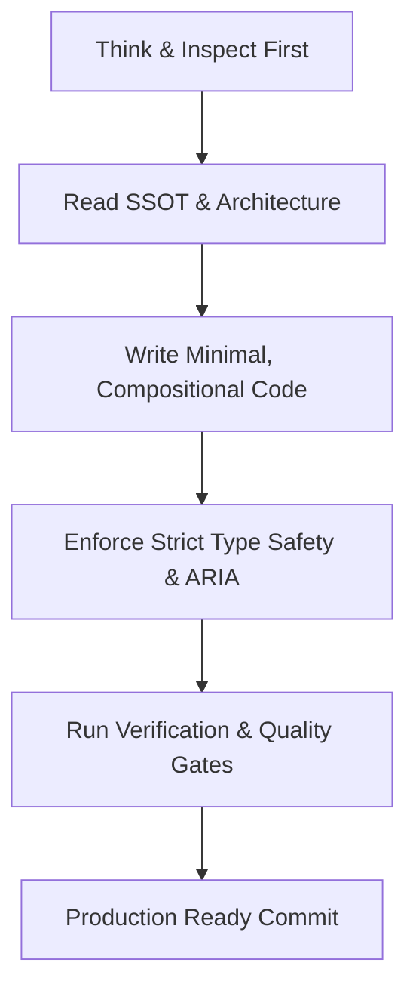

# ENGINEERING_STANDARDS.md

Version: 1.0  
Project: Pritish Kumar Panda Portfolio  
Author: Google Staff Software Engineer & Principal Frontend Architect  

---

# 1. Engineering Philosophy

## Core Mindset
Engineering at this repository is guided by a **production-first, long-term maintainability mindset**. Code written today must be self-explanatory, strictly typed, accessible, and performant six months from now, regardless of whether a human engineer or an AI agent modifies it.



## Decision Making & Trade-offs
When evaluating implementation alternatives, decisions must follow the strict priority hierarchy established in `AGENTS.md § Decision Hierarchy`:

1. **User / Recruiter Experience** (Scan velocity, clarity, responsiveness)
2. **Maintainability** (Modular structure, SSOT compliance, zero code duplication)
3. **Performance** (Lighthouse ≥95, JS budget <150KB, 60fps animations)
4. **Accessibility** (WCAG 2.1 AA compliance, zero `axe-core` errors)
5. **Scalability** (Decoupled frontend/backend, extensible component primitives)
6. **Visual Polish** (Glassmorphic dark design system, micro-interactions)
7. **Development Speed** (Never sacrifice quality gates for artificial speed)

---

# 2. Repository Standards

## Directory Structure & Module Boundaries
The codebase follows a strict feature-based directory organization per `ARCHITECTURE.md`:

```
frontend/
├── app/                  # Next.js 15 App Router pages & route handlers
├── components/           # 5-tier component architecture
│   ├── ui/               # Low-level atomic primitives (Button, Dialog, Badge)
│   ├── layout/           # Page framing (TopNav, MobileDock, SiteFooter)
│   ├── sections/         # Homepage sections (HeroSection, FeaturedProjects)
│   ├── effects/          # Motion & scroll wrappers (CursorGlow, LenisProvider)
│   └── providers/        # Client React context providers
├── lib/                  # Single Source of Truth data & utilities
│   ├── data/portfolio.ts # Absolute SSOT for text, metrics, and links
│   └── utils.ts          # Pure helper utilities
└── public/               # Optimized static public assets
```

## File & Component Constraints
- **File Size Limit**: No file may exceed **350 lines of code**. If a file exceeds this threshold, break sub-views into modular child components.
- **Component Size Limit**: Single React components should stay under **150 lines**.
- **Naming Conventions**:
  - Files & Folders: Lowercase `kebab-case` (e.g., `spotlight-card.tsx`).
  - React Components: `PascalCase` matching export name (e.g., `SpotlightCard`).
  - Utility Functions: `camelCase` (e.g., `sanitizeInput`).
  - Constants & Enums: `UPPER_SNAKE_CASE` or `as const` objects.
- **Import Rules**:
  - Always use path alias `@/*` mapping to `frontend/` root.
  - Never use relative nested paths like `../../../../components/ui/button`.
  - Group imports in order: (1) React/Next native, (2) 3rd party packages, (3) `@/components`, (4) `@/lib`, (5) styles.
- **Barrel Exports**: Avoid wildcard `export *` barrel files. Use explicit named imports to enable optimal tree-shaking.

---

# 3. TypeScript Standards

## Strict Mode & Type Safety
- **Strict Compiler Flag**: `"strict": true` is enforced in `tsconfig.json`.
- **Zero `any` Policy**: The `any` type is strictly forbidden. Use explicit interfaces, type aliases, or `unknown` with narrow type guards.
- **No Non-Null Assertions**: Avoid `object!.property`. Use optional chaining (`object?.property`) and explicit null checks.

## Interfaces vs Types
- Use `type` for component prop contracts, unions, and primitives:
  ```typescript
  export type ButtonProps = React.ButtonHTMLAttributes<HTMLButtonElement> & {
    variant?: "default" | "secondary" | "ghost";
    size?: "default" | "sm" | "lg";
  };
  ```
- Use `interface` for expandable object schemas or data models.
- Immutable configuration objects MUST use `as const` assertions (e.g., `siteConfig` in `portfolio.ts`).

## Enums vs String Unions
- Prefer string union literals (`"chat" | "events" | "security"`) over TypeScript `enum` constructs to keep JS payload small and tree-shakeable.

---

# 4. React Standards

## Server vs Client Components
- **Server Components First**: Next.js 15 App Router components are Server Components by default. Keep components on the server unless interactivity, state, or DOM APIs are required.
- **Leaf-Level `'use client'`**: Place the `'use client'` directive strictly at the lowest interactive leaf component level (e.g., `SpotlightCard`, `Dialog`, `MagneticLink`). Never mark root layouts or dynamic section wrappers as client components unnecessarily.

## Hooks & State Discipline
- **Custom Hooks**: Extract complex stateful logic or media queries into custom reusable hooks in `lib/hooks/` (e.g., `useAmbientMotion`).
- **Dependency Arrays**: All `useEffect` and `useCallback` dependency arrays must be complete. Never suppress ESLint `react-hooks/exhaustive-deps`.
- **Memoization**: Use `useMemo` and `useCallback` strictly for expensive calculations (e.g., sorting/filtering large arrays) or stabilizing callbacks passed to memoized children. Do not pre-optimize trivial values.

---

# 5. Next.js Standards

## App Router Conventions
- **Routing**: Single-Page Application (SPA) architecture using hash anchors (`#profile`, `#projects`, `#experience`, `#contact`) in `app/page.tsx`.
- **Metadata API**: Define `export const metadata: Metadata` in `layout.tsx`. Title format MUST use em dash (`—`) per `SEO.md`:
  `${siteConfig.name} — ${siteConfig.role}`.
- **Dynamic Imports**: Below-the-fold sections (`FeaturedProjects`, `SkillsSection`, `ContactSection`) MUST be dynamically imported via `next/dynamic` with lightweight fallback shells:
  ```typescript
  const FeaturedProjects = dynamic(() => import("@/components/sections/featured-projects"), {
    loading: () => <SectionFallback label="Loading flagship projects" />
  });
  ```
- **Route Handlers**: API endpoints in `app/api/` (e.g., `app/api/contact/route.ts`) must return structured `NextResponse.json()` responses with explicit HTTP status codes (`201 Created`, `400 Bad Request`, `503 Service Unavailable`).

---

# 6. Styling Standards

## Tailwind CSS & Design Tokens
- **Token Compliance**: All colors, fonts, shadows, and keyframes MUST reference design tokens defined in `globals.css` and `tailwind.config.ts`.
- **No Hardcoded Hex Values**: Inline hex values like `#8B5CF6` inside component JSX are strictly prohibited. Use `bg-primary`, `text-muted`, `border-border`, `bg-card`.
- **Glassmorphism Utility**: Glass surfaces must use the standardized `.glass-panel` utility class (`bg-white/[0.04] border-white/10 shadow-soft backdrop-blur-xl`).
- **Responsive Breakpoints**: Mobile-first design is mandatory. Default utility classes target mobile (<640px); use `sm:`, `md:`, `lg:`, `xl:` for progressive desktop enhancement.

---

# 7. Component Standards

## Structure & Prop Contracts
Every component file must follow a predictable 4-part structure:

1. **Directive & Imports** (`"use client"`, React/Next imports, UI primitives, SSOT data, utils).
2. **Type Definitions** (Explicit `Props` type interface).
3. **Component Function** (Named export, memoized logic, JSX return).
4. **Helper Components / Sub-views** (Internal modular helper sub-components).

## Reusability & Composition
- Check `COMPONENTS.md` before creating any new component. Extend or compose existing primitives in `components/ui/`.
- Use `class-variance-authority` (`cva`) for UI component variant definitions (e.g., `Button`).
- Support component composition using `@radix-ui/react-slot` (`asChild` pattern).

---

# 8. State Management Standards

## State Decision Matrix

| State Type | Scope | Mechanism / Tool | Example Usage |
|---|---|---|---|
| **SSOT Data** | Global | `frontend/lib/data/portfolio.ts` | Project copy, metrics, social links |
| **URL State** | Global | Native Hash Anchors (`#projects`) | Active section navigation |
| **UI State** | Local | `useState` / `useReducer` | Modal open/close, form fields |
| **Scroll State** | Global | Lenis / Framer Motion | Smooth scroll physics, progress bar |
| **Server State** | Route | Next.js Serverless Route Handlers | POST `/api/contact` email delivery |

*Rule*: Global state libraries (Redux, Zustand) are explicitly prohibited for this single-page portfolio.

---

# 9. API & Backend Standards

## Endpoint Contracts & Validation
- **Input Validation**: Validate all incoming payloads using `express-validator` (backend) or schema validation before processing.
- **XSS & Injection Protection**: Sanitize string inputs using `sanitizeInput` (`lib/utils.ts`) or `express-mongo-sanitize`.
- **Error Format**: All API responses must return structured JSON:
  ```json
  { "success": false, "error": "Descriptive error message" }
  ```
- **Security Headers**: API responses must enforce Helmet headers, strict CORS origins, rate limiting (`express-rate-limit`), and UUID tracing (`X-Request-Id`).

---

# 10. Performance Standards

## Performance Budget Targets
Per `PERFORMANCE.md`:

| Metric | Budget Target | Action Threshold |
|---|---|---|
| **Lighthouse Score** | ≥95 | Block deployment if <95 |
| **LCP (Largest Contentful Paint)** | <2.5s | Optimize hero asset delivery |
| **CLS (Cumulative Layout Shift)** | <0.1 | Explicit width/height on layout shells |
| **Initial Client JS** | <150KB gzipped | Enforce `next/dynamic` code-splitting |
| **Animation Frame Rate** | 60 FPS | Limit active visible animations to ≤6 |

## Motion Performance
- Limit CSS keyframe animations and Framer Motion transitions strictly to GPU-accelerated properties: `transform` and `opacity`.
- NEVER animate layout-triggering properties: `width`, `height`, `top`, `left`, `margin`, `padding`.

---

# 11. Accessibility Standards (WCAG 2.1 AA)

- **Keyboard Tab Order**: TopNav → Hero CTA → Section Anchors → MobileDock → Footer.
- **Focus Rings**: All interactive controls must feature the standardized focus ring:
  `focus-visible:outline-none focus-visible:ring-2 focus-visible:ring-violet-400/60 focus-visible:ring-offset-2 focus-visible:ring-offset-black`.
- **Focus Trap & Restoration**: Modal overlays (`Dialog`) must trap keyboard focus and restore focus to trigger button upon closure.
- **ARIA Labels**: Icon-only buttons must specify `aria-label` or `<span className="sr-only">`. Decorative graphics must specify `aria-hidden="true"`.
- **Reduced Motion**: Respect OS preference (`prefers-reduced-motion: reduce`) by disabling smooth scroll inertia, cursor glow, and continuous floating keyframes.

---

# 12. Security Standards

- **Secret Protection**: Never commit environment credentials (`.env`, `EMAIL_PASS`, `OPENAI_API_KEY`) to Git.
- **HTML Sanitization**: Convert HTML reserved characters (`<`, `>`, `"`, `'`, `&`) to safe entity codes prior to serverless email transmission.
- **Content Security Policy**: Enforce `nosniff`, `DENY` framing, and strict referrer policy in `next.config.ts`.

---

# 13. Git & Commit Standards

## Commit Message Protocol
Follow Conventional Commits format:
- `feat(scope)`: New feature addition.
- `fix(scope)`: Bug fix.
- `refactor(scope)`: Code refactoring without behavioral change.
- `perf(scope)`: Performance optimization pass.
- `docs(scope)`: Documentation update.
- `chore(scope)`: Maintenance or config update.

*Example*: `feat(projects): add stateful agent preview surface to AstroAgent case study`

---

# 14. Documentation Standards

- All public functions, utility modules, and complex algorithms must include JSDoc comments explaining parameters and return types.
- Whenever a component, prop contract, or architectural pattern changes, update the corresponding documentation file (`COMPONENTS.md`, `ARCHITECTURE.md`, `DESIGN_SYSTEM.md`, `MASTER_PLAN.md`).

---

# 15. Quality Gates & Feature Validation Policy

A pull request or task is complete ONLY when it satisfies all 10 quality gates and the **Feature Validation Policy**:

- [x] **Typed**: `npm run typecheck` passes with **0 errors**.
- [x] **Linted**: `npm run lint` passes with **0 warnings / 0 errors**.
- [x] **Responsive**: Verified across 375px, 768px, 1024px, 1440px viewports.
- [x] **Accessible**: Keyboard navigable, focus ring visible, WCAG AA compliant.
- [x] **Performant**: GPU-only animations, below-the-fold dynamic imports.
- [x] **Secure**: Inputs sanitized, secrets protected, security headers active.
- [x] **SSOT Compliant**: All content sourced from `lib/data/portfolio.ts`.
- [x] **Documented**: Relevant architecture, component registries, or feature specs updated.
- [x] **Production Ready**: Verified clean execution without console errors.
- [x] **Manually Verified**: Complete "How to Test" guide written in the Feature Spec, manually executed, and all steps passed with 0 regressions.

---

# 16. Anti-Patterns (Forbidden List)

The following practices are strictly forbidden in this repository:

1. ❌ Marking a feature or task as DONE without writing and executing a "How to Test" guide.
2. ❌ Using `any` or non-null assertions (`!`).
3. ❌ Hardcoding colors, font sizes, or inline CSS styles inside component JSX.
4. ❌ Hardcoding portfolio copy, metrics, or links directly in JSX (must consume `portfolio.ts` SSOT).
5. ❌ Marking root layouts or static page wrappers with `'use client'`.
6. ❌ Creating duplicate UI components when a primitive exists in `components/ui/`.
7. ❌ Animating layout properties (`width`, `height`, `top`, `left`, `margin`).
8. ❌ Suppressing ESLint rules or commenting out failing tests.
9. ❌ Fabricating metrics, experience, job titles, or company names (`AGENTS.md § Never Assume`).
10. ❌ Writing monolithic component files exceeding 350 lines of code.

---

# 17. Engineering Verification Checklist

Before submitting code changes, execute the following verification steps:

```bash
# 1. Typecheck validation
cd frontend && npm run typecheck

# 2. ESLint code quality check
cd frontend && npm run lint

# 3. Backend test suite
cd backend && npm test
```

- [ ] All 3 commands execute with 0 errors.
- [ ] Visual inspection confirms zero horizontal overflow on mobile viewports.
- [ ] Keyboard tab test verifies focus ring visibility and modal focus traps.
- [ ] Feature-specific **"How to Test"** manual testing steps executed and passed.
