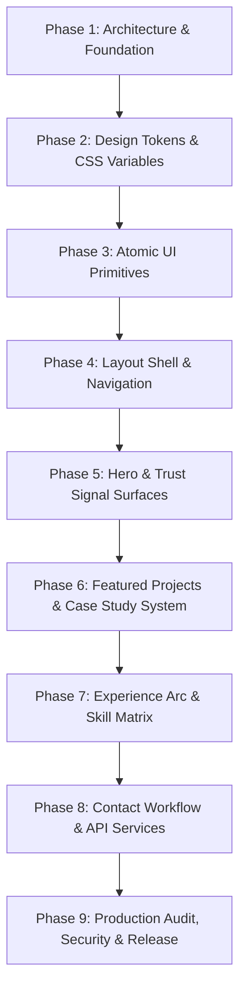
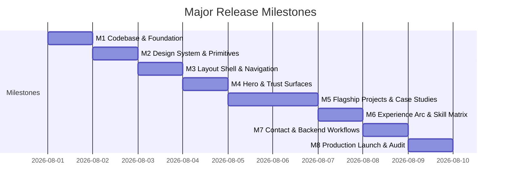
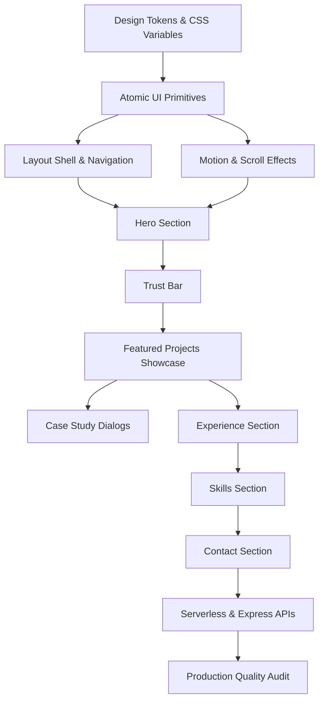
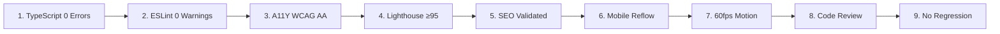

# MASTER_PLAN.md

Version: 1.0  
Project: Pritish Kumar Panda Portfolio  
Author: Lead Software Architect & Staff Frontend Engineer  

---

# 1. Executive Summary

## Project Vision
The primary objective of this portfolio is to serve as a **conversion-focused engineering asset** that generates high-signal interview opportunities for **Pritish Kumar Panda** ("Backend Engineer With Full-Stack Depth"). The repository is managed not as an aesthetic experiment or personal blog, but as a production software product optimizing for recruiter scan speed, hiring manager evaluation, and technical interviewer verification.

## Core Goals
1. **Recruiter Scan Velocity (3–30 Seconds)**: Immediately communicate identity, role alignment, core tech stack, live project links, and single-click resume/contact access.
2. **Hiring Manager Depth (30–300 Seconds)**: Provide deep engineering case studies for 5 flagship systems detailing real-world challenges, stateful/realtime architectures, trade-off decisions, and verifiable metrics.
3. **Interviewer Credibility Verification (5–15 Minutes)**: Prove end-to-end engineering discipline through clean Next.js 15 App Router code, production Express/MongoDB backend APIs, automated CI/CD checks, and zero-defect accessibility and performance scores.

## Success Criteria
- **Lighthouse Performance Score**: ≥95 across Performance, Accessibility, Best Practices, and SEO.
- **Bundle JS Budget**: Total initial client bundle <150KB gzipped.
- **Accessibility Compliance**: 100% WCAG 2.1 Level AA pass rate with zero automated `axe-core` violations.
- **Zero Quality Defect Bar**: 0 TypeScript compilation errors (`tsc --noEmit`), 0 ESLint warnings/errors (`eslint .`).
- **Conversion Efficiency**: One-click resume download and contact paths accessible from any scroll position.

## Project Philosophy
- *Think before coding; read before modifying; improve instead of replacing.*
- *Engineering quality and recruiter utility beat visual trends and unnecessary decoration.*
- *Single Source of Truth (SSOT)*: All copy, project metrics, case study details, and links originate from `frontend/lib/data/portfolio.ts`.

## Expected Final Outcome
A world-class, production-deployed monorepo featuring a Next.js 15 App Router frontend hosted on **Vercel** and a hardened Express/Node.js/MongoDB/Redis backend hosted on **Render**, meeting the engineering standards of Vercel, Stripe, Linear, and Raycast.

---

# 2. Current Status

| Dimension | Status | Notes / Reference |
|---|---|---|
| **Documentation System** | `[COMPLETED]` | 12 core documentation files (`AGENTS.md`, `PORTFOLIO.md`, `DESIGN_SYSTEM.md`, `ARCHITECTURE.md`, `COMPONENTS.md`, `CONTENT.md`, `ANIMATIONS.md`, `PERFORMANCE.md`, `ACCESSIBILITY.md`, `SEO.md`, `ROADMAP.md`, `TODO.md`) + 7 `PROMPTS/` files. |
| **Legacy Codebase Cleanup** | `[COMPLETED]` | Legacy Vite SPA folder `frontend/src/` and `frontend/vite.config.js` purged; `eslint` & `tsconfig` configuration updated. |
| **Shared UI Primitives** | `[COMPLETED]` | Atomic primitives (`Badge`, `Button`, `Dialog`, `MagneticLink`, `Marquee`, `SectionHeading`, `SpotlightCard`) verified. |
| **Page Layout & Sections** | `[COMPLETED]` | `HeroSection`, `TrustBar`, `FeaturedProjects`, `ExperienceSection`, `SkillsSection`, `ContactSection`, `TopNav`, `MobileDock`, `SiteFooter` active. |
| **Backend Infrastructure** | `[COMPLETED]` | Express server (`server.js`) with Mongoose Atlas pooling, 90-day TTL index, ioredis fallback, Pino logging, and Nodemailer email transport. |
| **SEO & Structured Data** | `[COMPLETED]` | Title metadata updated to em dash (`—`) delimiter in `layout.tsx`; `Person` and `WebSite` JSON-LD schemas embedded in `page.tsx`. |

## Active Risks & Mitigations
- **Risk**: Environment variable drift for production email/backend deployment.  
  *Mitigation*: Strict fallback and error notices implemented in `app/api/contact/route.ts`.
- **Risk**: Large bundle size growth if heavy dynamic libraries are added.  
  *Mitigation*: Enforce dynamic imports via `next/dynamic` for below-the-fold sections (`FeaturedProjects`, `SkillsSection`, `ContactSection`).

---

# 3. Development Phases

---

### Phase 1 — Architecture & Monorepo Foundation
- **Objective**: Establish monorepo structure, Next.js 15 App Router configuration, TypeScript path aliases, and backend Express layer.
- **Deliverables**: Purged legacy code, verified `package.json` workspaces, configured `tsconfig.json` and `eslint.config.js`.
- **Dependencies**: Repository initialization.
- **Acceptance Criteria**: `npm run typecheck` and `npm run lint` execute with 0 errors.
- **Definition of Done**: Clean monorepo directory layout complying with `ARCHITECTURE.md § Directory Structure`.
- **Risks**: Lingering references to deleted files.
- **Estimated Difficulty**: Low | **Estimated Time**: 0.5 Days

---

### Phase 2 — Design System & Visual Tokens
- **Objective**: Define CSS custom properties, Tailwind tokens, typography stack, and glassmorphic surface utilities.
- **Deliverables**: `frontend/app/globals.css` `:root` variables, `frontend/tailwind.config.ts` extended color palette and keyframes.
- **Dependencies**: Phase 1.
- **Acceptance Criteria**: All colors reference tokens (`--background: #050816`, `--primary: #8B5CF6`). No hardcoded color hexes in component files.
- **Definition of Done**: Conformance with `DESIGN_SYSTEM.md § Color System` and `Typography`.
- **Risks**: Theme contrast violations against WCAG AA standards.
- **Estimated Difficulty**: Low | **Estimated Time**: 0.5 Days

---

### Phase 3 — Shared UI Component Registry
- **Objective**: Build atomic UI primitives adhering to high-reusability component standards.
- **Deliverables**: `Badge`, `Button` (CVA + Radix Slot), `Dialog` (Radix UI overlay), `MagneticLink` (GSAP), `Marquee` (CSS keyframe), `SectionHeading`, `SpotlightCard`.
- **Dependencies**: Phase 2.
- **Acceptance Criteria**: Full keyboard navigation, visible focus ring (`focus-visible:ring-2 focus-visible:ring-violet-400/60`), typed prop interfaces.
- **Definition of Done**: Compliance with `COMPONENTS.md § UI Primitives`.
- **Risks**: Focus trap leaks or ARIA dialog attribute gaps.
- **Estimated Difficulty**: Medium | **Estimated Time**: 1 Day

---

### Phase 4 — Navigation & Layout Shell
- **Objective**: Implement fixed header navigation, responsive mobile dock, site footer, and global motion providers.
- **Deliverables**: `TopNav`, `MobileDock`, `SiteFooter`, `SiteProviders` (`LenisProvider`, `CursorGlow`, `ScrollProgress`).
- **Dependencies**: Phase 3.
- **Acceptance Criteria**: Mobile dock visible on `<1024px` with active section tracking; Lenis and CursorGlow automatically respect `prefers-reduced-motion: reduce`.
- **Definition of Done**: Compliance with `ACCESSIBILITY.md § Keyboard Navigation` and `ANIMATIONS.md § Motion Tokens`.
- **Risks**: Touch device gesture conflicts.
- **Estimated Difficulty**: Medium | **Estimated Time**: 1 Day

---

### Phase 5 — Hero & Trust Signal Surfaces
- **Objective**: Build primary landing hero and 10-second credibility bar for instant recruiter conversion.
- **Deliverables**: `HeroSection` (Space Grotesk typography, interactive terminal, quick launchpad), `TrustBar` (marquee ticker, metric grid).
- **Dependencies**: Phase 4.
- **Acceptance Criteria**: Recruiter role positioning delivered within 3 seconds; continuous marquee ticker runs off main JS thread via CSS keyframes.
- **Definition of Done**: Conformance with `CONTENT.md § Hero` and `Trust Bar`.
- **Risks**: Layout shifts during typing animation.
- **Estimated Difficulty**: Medium | **Estimated Time**: 1 Day

---

### Phase 6 — Featured Projects & Case Study System
- **Objective**: Deliver interactive case study showcase for 5 production systems.
- **Deliverables**: `FeaturedProjects` with tabbed project navigation, animated preview surfaces, Radix Dialog case study overlay.
- **Dependencies**: Phase 5.
- **Acceptance Criteria**: All 5 projects (`Aradhana AstroAgent`, `Knot of Love`, `Vireon`, `Fuel Route Optimisation`, `ImageSteg`) render from `portfolio.ts`. Modals support keyboard `Escape` dismissal and focus restoration.
- **Definition of Done**: Compliance with `CONTENT.md § Featured Projects` and `COMPONENTS.md § Featured Projects`.
- **Risks**: Heavy re-render latency during modal tab switches.
- **Estimated Difficulty**: High | **Estimated Time**: 2 Days

---

### Phase 7 — Experience Arc & Skill Matrix
- **Objective**: Present career trajectory and domain-grouped skill matrix without artificial progress indicators.
- **Deliverables**: `ExperienceSection` timeline card, `SkillsSection` 6-domain spotlight grid.
- **Dependencies**: Phase 6.
- **Acceptance Criteria**: Factually accurate content; 0 fabricated metrics; scannable in <5 seconds.
- **Definition of Done**: Conformance with `CONTENT.md § Experience` and `Skills`.
- **Risks**: Responsive grid breaking on mid-size tablet viewports.
- **Estimated Difficulty**: Medium | **Estimated Time**: 1 Day

---

### Phase 8 — Contact Workflow & Backend Integration
- **Objective**: Build direct recruiter contact form and secure serverless/Express delivery channels.
- **Deliverables**: `ContactSection` form UI, `frontend/app/api/contact/route.ts` serverless Nodemailer endpoint, backend `backend/src/routes/contact.js` API.
- **Dependencies**: Phase 7.
- **Acceptance Criteria**: Client-side validation, XSS sanitization, character counters, `aria-live` status announcements, and graceful SMTP failure handling.
- **Definition of Done**: Compliance with `ARCHITECTURE.md § Security` and `ACCESSIBILITY.md § Interactive Elements`.
- **Risks**: Spam payload submissions.
- **Estimated Difficulty**: Medium | **Estimated Time**: 1 Day

---

### Phase 9 — Production Audit, Security & Release
- **Objective**: Final Lighthouse, A11Y, SEO, and performance optimization audit prior to production deployment.
- **Deliverables**: Validated `sitemap.xml`, `robots.txt`, `site.webmanifest`, `og-image.png`, `Person` and `WebSite` JSON-LD schemas.
- **Dependencies**: Phase 8.
- **Acceptance Criteria**: Lighthouse ≥95, 0 TypeScript/ESLint errors, clean mobile breakpoint reflow.
- **Definition of Done**: Compliance with `AGENTS.md § Review Checklist` and `SEO.md`.
- **Risks**: Production domain CORS misconfigurations.
- **Estimated Difficulty**: Medium | **Estimated Time**: 1 Day

---

# 4. Milestones

1. **Milestone 1 (Foundational Build)**: Monorepo initialized, legacy code purged, TypeScript/ESLint configuration validated.
2. **Milestone 2 (Design System Assembly)**: CSS custom properties, Tailwind theme mapping, and 7 atomic UI primitives completed.
3. **Milestone 3 (Interactive Frame)**: TopNav, MobileDock, SiteFooter, and motion providers deployed with reduced motion support.
4. **Milestone 4 (Recruiter Hero Launch)**: Hero section and trust bar deployed for 3-second positioning and 10-second proof.
5. **Milestone 5 (Engineering Case Studies)**: Featured projects showcase deployed with tabbed switcher and accessible case study dialogs.
6. **Milestone 6 (Career & Capability Grid)**: Experience arc timeline and 6-domain skill matrix deployed.
7. **Milestone 7 (Contact System Integration)**: Contact surface connected to serverless Nodemailer and Express backend APIs.
8. **Milestone 8 (Production Deployment)**: Full Vercel/Render production deployment passing all Lighthouse, SEO, and A11Y quality gates.

---

# 5. Sprint Breakdown

### Sprint 1: Foundation, Tokens & Primitives
- **Goals**: Purge legacy Vite assets, configure Next.js 15 compiler, build 7 atomic UI primitives.
- **Deliverables**: `frontend/app/globals.css`, `frontend/tailwind.config.ts`, `frontend/components/ui/*`.
- **Files Affected**: `frontend/eslint.config.js`, `frontend/tsconfig.json`, `frontend/components/ui/*`.
- **Exit Criteria**: `npm run typecheck` passes with 0 errors; UI primitives pass keyboard focus audit.

### Sprint 2: Shell, Navigation & Hero Surfaces
- **Goals**: Implement layout shell, scroll effects, hero section, and trust signals.
- **Deliverables**: `TopNav`, `MobileDock`, `SiteFooter`, `LenisProvider`, `CursorGlow`, `HeroSection`, `TrustBar`.
- **Files Affected**: `frontend/components/layout/*`, `frontend/components/effects/*`, `frontend/components/sections/*`.
- **Exit Criteria**: Recruiter 3-second headline visible; marquee ticker operates continuously on CSS keyframes.

### Sprint 3: Projects, Experience & Skills Showcase
- **Goals**: Implement tabbed project showcase, case study modal overlays, experience timeline, and skill grid.
- **Deliverables**: `FeaturedProjects`, `ExperienceSection`, `SkillsSection`.
- **Files Affected**: `frontend/components/sections/*`, `frontend/lib/data/portfolio.ts`.
- **Exit Criteria**: All 5 projects render with live links; Radix Dialog traps focus and dismisses on Escape.

### Sprint 4: Contact System, SEO Audit & Launch
- **Goals**: Build contact surface, connect serverless/backend API handlers, execute full Lighthouse and SEO audit.
- **Deliverables**: `ContactSection`, `frontend/app/api/contact/route.ts`, `backend/src/routes/contact.js`, metadata updates.
- **Files Affected**: `frontend/app/layout.tsx`, `frontend/app/page.tsx`, `frontend/app/api/contact/route.ts`.
- **Exit Criteria**: Form submission succeeds; title uses em dash; JSON-LD schemas validate; Lighthouse ≥95.

---

# 6. Dependency Graph

---

# 7. Risk Analysis & Mitigation Matrix

| Category | Risk Description | Impact | Likelihood | Mitigation Strategy |
|---|---|---|---|---|
| **Technical** | Motion library bundle bloating client JS budget | High | Medium | Restrict Framer Motion to entrance reveals; use CSS `@keyframes` for continuous loops. |
| **Design** | Low text contrast on dark glassmorphic panels | High | Low | Enforce `text-slate-300` / `text-slate-400` on `#050816` canvas (minimum 4.5:1 ratio). |
| **Performance** | Above-the-fold render blocking from dynamic sections | High | Medium | Use `next/dynamic` lazy loading for below-the-fold sections (`FeaturedProjects`, `SkillsSection`, `ContactSection`). |
| **Accessibility**| Focus trapping failure or loss of focus on modal close | High | Low | Use `@radix-ui/react-dialog` primitives which handle focus restoration automatically. |
| **SEO** | Truncated titles or broken OG card social previews | Medium | Low | Validate title patterns (`em dash`) and 1200x630px PNG specs per `SEO.md`. |
| **Content** | Unverified metric or experience claims damaging credibility | High | Low | Enforce strict `AGENTS.md § Never Assume` policy. Only publish explicit factual data from `portfolio.ts`. |
| **Maintenance**| Data duplication across component JSX files | Medium | Low | Force all text, metrics, and project content to consume `frontend/lib/data/portfolio.ts` SSOT. |

---

# 8. Quality Gates

Before declaring any phase or milestone complete, the codebase MUST pass all 9 quality gates:

1. **TypeScript Gate**: `npm run typecheck` (`tsc --noEmit`) passes with zero errors.
2. **Linting Gate**: `npm run lint` (`eslint .`) passes with zero errors or warnings.
3. **Accessibility Gate**: Keyboard-navigable, focus rings visible, zero `axe-core` violations.
4. **Performance Gate**: Lighthouse score ≥95; initial bundle <150KB gzipped.
5. **SEO Gate**: Valid HTML semantics, canonical tags, `Person` and `WebSite` JSON-LD schemas.
6. **Responsiveness Gate**: Tested across 375px, 640px, 768px, 1024px, and 1440px viewports.
7. **Animation Gate**: GPU-accelerated (`transform`, `opacity`); `prefers-reduced-motion` respected.
8. **Code Review Gate**: Reusable abstractions used; no duplicated logic; no magic values.
9. **Zero Regression Gate**: Existing build scripts and backend endpoints function cleanly.

---

# 9. Testing Strategy

- **Manual Keyboard Audit**: Tab through document from skip link to footer; verify modal trap and `Escape` key overlay closure.
- **Responsive Layout Testing**: Inspect reflow across mobile (375px), tablet (768px), desktop (1024px), and ultrawide (1440px+).
- **Accessibility Testing**: Execute automated `axe-core` scan; verify NVDA/VoiceOver landmark reading and `aria-live` form status announcements.
- **Performance Profiling**: Audit Chrome DevTools Performance panel for long tasks (>50ms); verify 60fps marquee and spotlight movement.
- **Cross-Browser Verification**: Validate rendering across Chrome, Firefox, Safari (iOS), and Edge.
- **Regression Testing**: Execute backend Jest test suite (`npm test --prefix backend`).

---

# 10. Release Strategy

- **Development**: Local development using `npm run dev` in `frontend/` and `backend/`.
- **Preview Deployment**: Automated Vercel preview environments generated for every GitHub pull request.
- **Production Deployment**: Continuous Integration / Continuous Deployment (CI/CD) triggering automatic Vercel production deployment upon merging to `main`.
- **Rollback Strategy**: Instant one-click deployment rollback available via Vercel Dashboard to previous healthy git commit hash.
- **Versioning Protocol**: Semantic Versioning (`vMAJOR.MINOR.PATCH`) tracked in `package.json`.

---

# 11. Final Acceptance Checklist

### Engineering & Code Quality
- [x] Next.js 15 App Router architecture with TypeScript strict mode enabled.
- [x] Zero dead code or legacy files (`frontend/src/` purged).
- [x] Centralized Single Source of Truth in `frontend/lib/data/portfolio.ts`.
- [x] `npm run typecheck` passes with 0 errors.
- [x] `npm run lint` passes with 0 warnings/errors.

### Design System & Visuals
- [x] Deep navy-black canvas (`#050816`) with glassmorphic cards (`bg-white/[0.04]`).
- [x] Space Grotesk display typography and General Sans / Satoshi body copy.
- [x] Consistent button CVA variants (`default`, `secondary`, `ghost`).

### Recruiter Experience & Content
- [x] 3-second identity and role positioning clear in Hero section.
- [x] 10-second tech stack proof visible in Trust Bar.
- [x] 30-second project depth presented via 5 flagship case studies with metrics.
- [x] Single-click resume download accessible from TopNav and MobileDock.
- [x] Zero fabricated experience claims or metrics (100% compliant with `AGENTS.md`).

### Accessibility & SEO
- [x] WCAG 2.1 Level AA compliant with visible focus rings (`ring-violet-400/60`).
- [x] Keyboard focus trap and restoration managed via Radix UI Dialog.
- [x] Title metadata uses em dash delimiter (`—`).
- [x] `Person` and `WebSite` JSON-LD schemas embedded.

### Performance & Mobile
- [x] Lighthouse score ≥95.
- [x] Initial JS bundle budget <150KB gzipped.
- [x] Mobile dock navigation active on viewports <1024px.
- [x] Continuous animations respect `prefers-reduced-motion: reduce`.

---

# 12. Continuous Improvement Backlog

### Nice to Have
- Interactive architecture diagram toggles inside case study modals.
- Dynamic GitHub commit activity heat map integration.

### Future Version
- Dark/light mode theme engine evaluation (if brand guidelines evolve).
- Vercel Web Analytics integration for privacy-conscious visit tracking.

### Experimental
- WebGPU-accelerated background particle field.
- Dynamic PDF resume generation from `portfolio.ts` SSOT.

### Never Build (Explicitly Prohibited)
- Blog or content marketing CMS (keeps portfolio 100% conversion-focused).
- Heavy 3D canvas libraries (Three.js/Fiber) that compromise initial LCP load time.
- Self-assessed proficiency skill bars or percentage star ratings.

---

# References

- See `AGENTS.md` (Behavioral contract and review standards)
- See `PORTFOLIO.md` (Product vision and target recruiter personas)
- See `DESIGN_SYSTEM.md` (Design tokens and visual specifications)
- See `ARCHITECTURE.md` (Technical blueprint and routing design)
- See `COMPONENTS.md` (Component catalog and API specifications)
- See `CONTENT.md` (Content strategy and tone of voice)
- See `ANIMATIONS.md` (Motion tokens and accessibility specs)
- See `PERFORMANCE.md` (Core Web Vitals and performance budget)
- See `ACCESSIBILITY.md` (WCAG 2.1 Level AA specifications)
- See `SEO.md` (Search dominance and metadata guidelines)
- See `ROADMAP.md` (Phase history and strategic direction)
- See `TODO.md` (Tactical task tracking)
